# Epstein Financial Shell Network

**14 entities · 8+ banks · 178,592 money references · 1.48M documents**

> **📊 [Open the Interactive Visualization](https://randallscott25-star.github.io/epstein-forensic-finance/visualizations/shell_network.html)** — Click any node for detail panel. Filter by shell co-occurrence, bank relationships, or Deutsche Bank wire ledger.

---

## Network Architecture

```mermaid
flowchart TD
    subgraph SOURCES["EXTERNAL SOURCES"]
        BLACK["Leon Black / Apollo\n$60.5M"]
        ROTHSCHILD["Rothschild\n$25M"]
        AUCTIONS["Sotheby's / Christie's\n$19M"]
        TUDOR["Tudor Futures\n$13.5M"]
        KELLERHALS["Kellerhals Ferguson\n$23.1M"]
    end

    subgraph BANKS["BANKING INSTITUTIONS"]
        BS["🏦 Bear Stearns\n2.4M money refs\n#1 by volume"]
        JPM["🏦 JPMorgan Chase\n744K money refs"]
        DB["🏦 Deutsche Bank\n415K money refs\n$150M DFS fine → wire production"]
        WF["🏦 Wells Fargo · BofA\nTD · PNC · Sabadell"]
        OTHER_BANK["🏦 Citibank · HSBC\nGoldman · Morgan Stanley\nBank of Hawaii"]
    end

    subgraph HUB["CORE HUB — 163 shared documents"]
        ST["🔶 Southern Trust Co.\n883 files · $244M wires\n78,569 money refs"]
        SF["🔶 Southern Financial\n628 files · $139M wires\n57,208 money refs"]
    end

    subgraph BROKERAGE["BROKERAGE CLUSTER — Bear Stearns"]
        FTC["🔴 Financial Trust Co.\n1,014 files · 325 financial\n❌ NO WIRE RECORD\nPrimary bank: Bear Stearns"]
        EC["🔴 Epstein & Co Inc.\n400 files · 174 financial\n❌ NO WIRE RECORD"]
        JEE["🔶 Jeepers Inc.\n270 files · $58M wires"]
    end

    subgraph TRUSTS["TRUST LAYER"]
        HAZE["🔶 Haze Trust\n186 files · $126M wires\nHSBC Bermuda connection"]
        BUTT["🔴 Butterfly Trust\n219 files · 73 financial\n❌ NO WIRE RECORD"]
        INS["🔴 Insurance Trust\n71 files · 7,800 money refs\n❌ NO WIRE RECORD"]
        GRAT["🔶 Gratitude America\n209 files · $45M wires\nDeutsche Bank + Morgan Stanley"]
    end

    subgraph COMMS["COMMUNICATION HUB"]
        HBRK["🟣 HBRK Associates\n13,389 files · 13,146 EMAILS\n❌ NO WIRE RECORD\nOperational nerve center"]
    end

    subgraph DISBURSEMENT["MULTI-BANK DISBURSEMENT"]
        OMT["🔴 Outgoing Money Trust\n195 files · 180 financial\n❌ NO WIRE RECORD\n7 banks: DB · WF · BofA\nJPM · TD · PNC · Sabadell"]
    end

    subgraph PERIPHERY["PERIPHERY"]
        PLAND["Plan D LLC\n$41M wires"]
        NAUT["Nautilus Inc.\nAircraft operations"]
        EI["Epstein Interests\nHolding company"]
    end

    subgraph OUTFLOW["OUTFLOW RECIPIENTS"]
        FUNDS["Investment Funds\n$131M+"]
        PEOPLE["Individuals\n$25M+"]
        EPSTEIN["Epstein Personal\n$107.3M terminal"]
    end

    %% Sources → Hub
    BLACK -->|"$60.5M"| ST
    ROTHSCHILD -->|"$25M"| ST
    TUDOR -->|"$13.5M"| SF
    AUCTIONS -->|"$19M"| HAZE
    KELLERHALS -->|"$23.1M"| EPSTEIN

    %% Hub interconnections
    ST <-->|"$67.9M\n163 shared docs"| SF

    %% Brokerage → Hub
    FTC -->|"126 shared docs"| EC
    FTC -->|"125 shared docs"| JEE
    FTC -->|"92 shared docs"| ST
    JEE -->|"$51.9M"| ST
    EC -->|"73 shared docs"| SF

    %% Trusts → Hub
    HAZE -->|"$32M"| SF
    HAZE -->|"$15M"| ST
    BUTT -->|"61 shared docs"| ST
    GRAT -->|"50 shared docs"| ST
    INS --> ST

    %% Communication hub touches everything
    HBRK -.->|"111 docs"| ST
    HBRK -.->|"104 docs"| SF
    HBRK -.->|"37 docs"| BUTT
    HBRK -.->|"32 docs"| HAZE
    HBRK -.->|"30 docs"| GRAT

    %% Multi-bank disbursement
    OMT --> ST

    %% Periphery
    PLAND -->|"$41M"| ST
    NAUT --> SF
    EI -->|"41 shared docs"| FTC

    %% Banks → Shells
    BS -.->|"66 files · 6,910 money refs"| FTC
    JPM -.-> OMT
    DB -.->|"wire production"| ST
    DB -.-> SF
    DB -.-> HAZE
    DB -.-> GRAT
    DB -.-> BUTT
    DB -.-> INS
    WF -.->|"63 files"| OMT
    OTHER_BANK -.-> HAZE
    OTHER_BANK -.-> GRAT

    %% Hub → Outflow
    SF --> FUNDS
    SF --> PEOPLE
    GRAT -->|"$225K"| FUNDS
    PLAND --> PEOPLE
    JEE -->|"$51.9M"| EPSTEIN

    %% Styling
    classDef hub fill:#2d2d1a,stroke:#e8c170,stroke-width:3px,color:#e8c170
    classDef nowire fill:#2d1a1a,stroke:#c86464,stroke-width:2px,color:#c86464
    classDef wire fill:#1a2d2d,stroke:#6ad0a0,stroke-width:1px,color:#6ad0a0
    classDef bank fill:#1a1a2d,stroke:#6aa4d0,stroke-width:2px,color:#6aa4d0
    classDef source fill:#1a2d1a,stroke:#80c880,stroke-width:1px,color:#80c880
    classDef outflow fill:#2d2d1a,stroke:#d0c86a,stroke-width:1px,color:#d0c86a
    classDef comms fill:#2d1a2d,stroke:#c86ac8,stroke-width:2px,color:#c86ac8

    class ST,SF hub
    class FTC,EC,BUTT,INS,OMT nowire
    class JEE,HAZE,GRAT,PLAND,NAUT,EI wire
    class BS,JPM,DB,WF,OTHER_BANK bank
    class BLACK,ROTHSCHILD,AUCTIONS,TUDOR,KELLERHALS source
    class FUNDS,PEOPLE,EPSTEIN outflow
    class HBRK comms
```

---

## How to Read This

| Symbol | Meaning |
|--------|---------|
| 🔶 **Gold** | Core hub — Southern Trust and Southern Financial. Every entity connects to at least one. |
| 🔴 **Red** | No wire transfer record in Deutsche Bank production. Banked at other institutions. |
| 🟣 **Purple** | Communication hub — HBRK Associates routes 13,146 emails across the network. |
| 🏦 **Blue** | Banking institutions. Deutsche Bank produced the wire records; Bear Stearns had 5.7× more money activity. |
| **Solid lines** | Verified wire transfers (dollar amounts) or strong document co-occurrence (shared file counts). |
| **Dashed lines** | Banking relationships or communication connections. |
| **❌ NO WIRE RECORD** | Entity appears in hundreds of financial documents but has zero verified wires in the Deutsche Bank production. These entities banked elsewhere. |

---

## Entity Reference

| Entity | Total Files | Financial Docs | Money Refs | Wire Ledger | Primary Bank |
|--------|-----------|----------------|------------|-------------|-------------|
| Southern Trust Co. | 883 | 178 | 78,569 | ✅ $244M | Deutsche Bank |
| Southern Financial LLC | 628 | 118 | 57,208 | ✅ $139M | Deutsche Bank |
| Financial Trust Co. | 1,014 | 325 | — | ❌ | Bear Stearns |
| Epstein & Co Inc. | 400 | 174 | 10,482 | ❌ | Bear Stearns |
| HBRK Associates | 13,389 | 95 | — | ❌ | — (email hub) |
| Gratitude America | 209 | 89 | 10,407 | ✅ $45M | Deutsche Bank + Morgan Stanley |
| Haze Trust | 186 | 12 | 8,486 | ✅ $126M | Deutsche Bank + HSBC |
| Outgoing Money Trust | 195 | 180 | 2,338 | ❌ | 7 banks |
| Butterfly Trust | 219 | 73 | 3,302 | ❌ | Deutsche Bank |
| Insurance Trust | 71 | 49 | 7,800 | ❌ | Deutsche Bank |
| Jeepers Inc. | 270 | 19 | — | ✅ $58M | Deutsche Bank |
| Epstein Interests | 116 | 28 | — | ❌ | — |
| Nautilus Inc. | 149 | 13 | — | ❌ | — (aircraft) |
| Plan D LLC | 55 | 8 | — | ✅ $41M | Deutsche Bank |

## Banking Institutions by Volume

| Bank | Money Mentions | Financial Files | Key Connection |
|------|---------------|-----------------|----------------|
| **Bear Stearns** | **2,381,211** | 191 | Financial Trust Co (66 shared files, 6,910 mentions) |
| **JPMorgan/Chase** | **744,536** | 615 | Outgoing Money Trust, Financial Trust Co |
| **Deutsche Bank** | **415,287** | 1,564 | All wire-ledger shells — source of Exhibits A–E |
| Citibank | 78,176 | 39 | Gratitude America |
| Goldman Sachs | 14,999 | 25 | TBD |
| HSBC | 13,389 | 44 | Haze Trust (Bermuda) |
| Morgan Stanley | 13,255 | 82 | Gratitude America |
| Bank of Hawaii | — | 734 | USVI operations (2,431 total files) |

---

*All amounts are (Unverified) automated extractions from DOJ EFTA documents. Appearance does not imply wrongdoing. See [Narrative 11: The Shell Map](narratives/11_the_shell_map.md) for the complete analysis. Supporting data: [Forensic Workbook (view-only)](https://docs.google.com/spreadsheets/d/11lw0QjMZ-rYIjWesv5VG1YKts57ahPEm/edit?usp=sharing&ouid=103970896670138914877&rtpof=true&sd=true) · [Master Wire Ledger](data/master_wire_ledger_phase25.json).*

*For the girls.*
